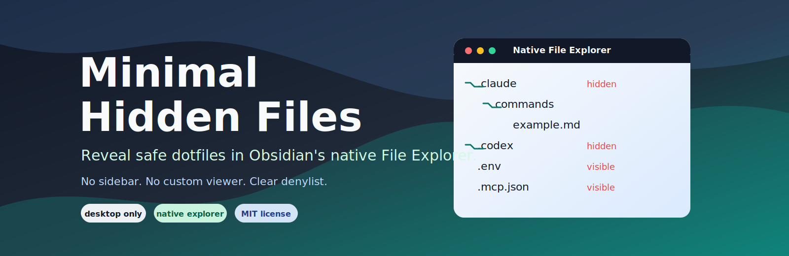
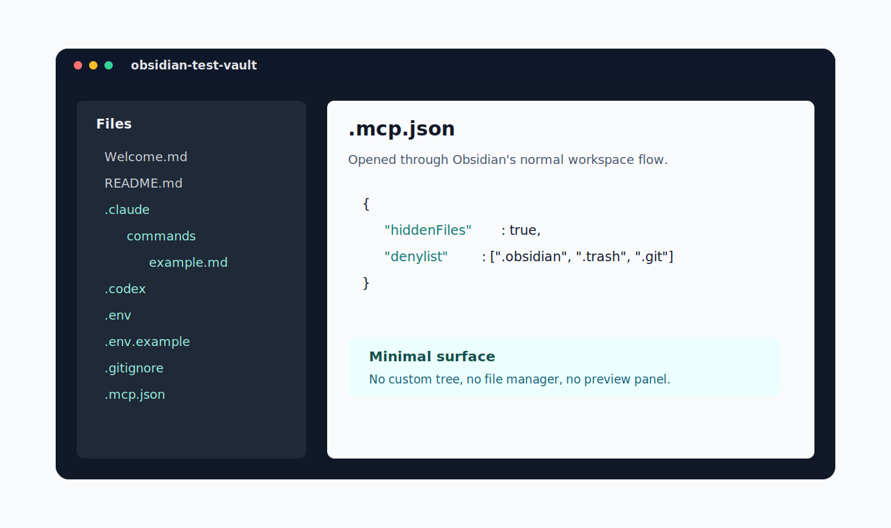

<p align="center">
  
</p>

<p align="center">
  <a href="https://github.com/viggomeesters/obsidian-minimal-hidden-files/releases/latest"></a>
  <a href="LICENSE"></a>
  
  
</p>

# Minimal Hidden Files

Minimal Hidden Files is a small desktop-only Obsidian plugin that reveals safe dotfiles and dotfolders in Obsidian's native File Explorer.

It does not add a sidebar, tree browser, preview panel, dashboard, or custom file manager. Files open through Obsidian's normal workspace flow in the middle pane.



## Features

- Shows allowed dotfiles such as `.gitignore`, `.env`, `.env.example`, and `.mcp.json` in the native File Explorer.
- Shows allowed dotfolders such as `.claude/` and `.codex/` in the native File Explorer.
- Enables Obsidian's native unsupported-file visibility setting while active, so non-Markdown files can appear in the explorer.
- Restores the previous unsupported-file visibility setting when the plugin is disabled.
- Excludes `.obsidian`, the active vault config directory, `.trash`, and `.git` by default in v0.1.
- Uses no runtime dependencies and no custom file-management UI.

## Safety and privacy

Minimal Hidden Files does not make network requests, does not use telemetry, and does not read or write outside your vault.

The plugin uses Obsidian's desktop file-system adapter and Node's `fs` module to detect whether a hidden vault path is a file or folder. This is why the plugin is desktop-only.

Revealed files use Obsidian's normal file behavior. Depending on the file type and installed plugins, a revealed file may be viewable, editable, movable, deleted, or opened by another community plugin. Minimal Hidden Files does not enforce read-only mode.

The v0.1 denylist is intentionally hardcoded:

- `.obsidian` and the active `Vault.configDir` stay hidden to avoid exposing workspace, plugin, and vault configuration internals.
- `.trash` stays hidden because it is not useful for normal navigation.
- `.git` stays hidden because it is noisy, large, and easy to damage.

## Installation

### Community plugin directory

Minimal Hidden Files is prepared for submission to the Obsidian Community plugin directory. Once accepted, it can be installed from **Settings -> Community plugins -> Browse** inside Obsidian.

### Manual installation

Until the community directory submission is accepted:

1. Download `main.js`, `manifest.json`, and `styles.css` from the [latest release](https://github.com/viggomeesters/obsidian-minimal-hidden-files/releases/latest).
2. Create this folder in your vault: `.obsidian/plugins/minimal-hidden-files/`.
3. Put the downloaded files in that folder.
4. Reload Obsidian.
5. Enable **Minimal Hidden Files** in **Settings -> Community plugins**.

### BRAT installation

For beta testing, install the plugin with [BRAT](https://github.com/TfTHacker/obsidian42-brat) using this repository URL:

```text
https://github.com/viggomeesters/obsidian-minimal-hidden-files
```

## Usage

Enable the plugin and use the built-in Obsidian File Explorer as usual. Allowed dotfiles and dotfolders will appear in the native tree.

Use the plugin settings to:

- reveal or hide allowed dotfiles and dotfolders
- sync Obsidian's native unsupported-file visibility setting

## How it works

Obsidian hides dot-prefixed files and folders during vault reconciliation. Minimal Hidden Files patches the desktop file-system adapter's internal `reconcileDeletion` method so allowed dot paths are registered instead of hidden. It then asks the adapter to rescan the vault.

Unsupported extensions are handled by Obsidian's own internal `vault.setConfig("showUnsupportedFiles", true)` setting.

These are internal Obsidian APIs. They keep the plugin minimal and native, but they may require maintenance if Obsidian changes its desktop adapter internals.

## Development

```bash
npm install
npm run lint
npm run typecheck
npm run build
```

For local development, copy or symlink this repository into `.obsidian/plugins/minimal-hidden-files/` inside a dedicated Obsidian test vault.

## Release process

Obsidian installs community plugin files from GitHub releases. For each release:

1. Update `manifest.json`, `package.json`, and `versions.json`.
2. Run `npm install`, `npm run lint`, `npm run typecheck`, and `npm run build`.
3. Create a GitHub release whose tag exactly matches `manifest.json.version`.
4. Attach `main.js`, `manifest.json`, and `styles.css` as release assets.

The release workflow in `.github/workflows/release.yml` can publish those assets after the version has been updated and committed.

## Community directory submission

The repository is prepared for Obsidian Community plugin submission. The remaining submission step must be completed by the repository owner in the Obsidian Community site because it requires signing in, linking GitHub, and confirming the developer policies/support commitment.

Submit this repository URL:

```text
https://github.com/viggomeesters/obsidian-minimal-hidden-files
```

The current release is ready for review when:

- root `README.md`, `LICENSE`, and `manifest.json` exist
- `manifest.json.id` is `minimal-hidden-files`
- `manifest.json.version` is `0.1.0`
- GitHub release `0.1.0` exists
- release assets include `main.js`, `manifest.json`, and `styles.css`
- `versions.json` maps plugin version `0.1.0` to minimum Obsidian version `1.8.0`

Official references:

- [Submit your plugin](https://docs.obsidian.md/Plugins/Releasing/Submit%20your%20plugin)
- [Manifest](https://docs.obsidian.md/Reference/Manifest)
- [Obsidian releases repository](https://github.com/obsidianmd/obsidian-releases)

## Attribution

Technical research for the native File Explorer hook included:

- [Show Hidden Files](https://github.com/witi42/obsidian-show-hidden-files)
- [Obsidian sample plugin](https://github.com/obsidianmd/obsidian-sample-plugin)

This repository is an independent minimal implementation. No source files were copied from those projects.

## License

[MIT](LICENSE)
